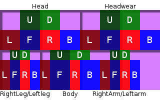
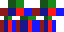

## 概述

本部分以制作全套红石盔甲为例，讲述如何做出一个新的盔甲，并讲述如何制作盔甲的材质。

## ArmorMaterial

和ToolMaterial类似，ArmorMaterial表示的就是盔甲的材质。

我们在包`com.github.ustc_zzzz.fmltutor.item`下新建一个文件`ItemRedstoneArmor.java`，并让`ItemRedstoneArmor`类继承`ItemArmor`类：

**`src/main/java/com/github/ustc_zzzz/fmltutor/item/ItemRedstoneArmor.java:`**

    package com.github.ustc_zzzz.fmltutor.item;
    
    import com.github.ustc_zzzz.fmltutor.FMLTutor;
    
    import net.minecraft.item.ItemArmor;
    import net.minecraftforge.common.util.EnumHelper;
    
    public class ItemRedstoneArmor extends ItemArmor
    {
        public static final ItemArmor.ArmorMaterial REDSTONE_ARMOR = EnumHelper.addArmorMaterial("REDSTONE",
                FMLTutor.MODID + ":" + "redstone", 10, new int[]
                { 2, 6, 4, 2 }, 10);
    
        public ItemRedstoneArmor(int armorType)
        {
            super(REDSTONE_ARMOR, REDSTONE_ARMOR.ordinal(), armorType);
        }
    }

和ToolMaterial一样，我们看看ArmorMaterial的构造方法：

    private ArmorMaterial(String name, int maxDamage, int[] reductionAmounts, int enchantability) {...}

和原版提供的五种材料的参数：

* `LEATHER("leather", 5, new int[]{1, 3, 2, 1}, 15),`
* `CHAIN("chainmail", 15, new int[]{2, 5, 4, 1}, 12),`
* `IRON("iron", 15, new int[]{2, 6, 5, 2}, 9),`
* `GOLD("gold", 7, new int[]{2, 5, 3, 1}, 25),`
* `DIAMOND("diamond", 33, new int[]{3, 8, 6, 3}, 10);`

ArmorMaterial的构造方法共有四个参数：

* `name`参数与该ArmorMaterial的材质所在位置有关，这一部分的稍后面会讲到。这里是“`fmltutor:redstone`”。
* `maxDamage`参数和该ArmorMaterial对应的盔甲的耐久成正比。这里刻意降低了大小，为10。
* `reductionAmounts`参数的四个元素表示对应盔甲的头盔、胸甲、护腿、和靴子抵御伤害的能力，如皮甲分别为1，3，2，1，和为7，钻石甲分别为3，8，6，3，和为20，**请不要让四个元素值的和超过这个值**。这里为2，6，4，2，和为14。
* `enchantability`参数和ToolMaterial一样，和对应盔甲的附魔能力正相关，同样，金盔甲的附魔能力最高。这里为10。

## 制作一套崭新的盔甲

在包`com.github.ustc_zzzz.fmltutor.item`下新建一个文件`ItemRedstoneArmor.java`，并让`ItemRedstoneArmor`类继承`ItemArmor`类：

**`src/main/java/com/github/ustc_zzzz/fmltutor/item/ItemRedstoneArmor.java（部分）:`**

        public static class Helmet extends ItemRedstoneArmor
        {
            public Helmet()
            {
                super(0);
                this.setUnlocalizedName("redstoneHelmet");
                this.setCreativeTab(CreativeTabsLoader.tabFMLTutor);
            }
        }
    
        public static class Chestplate extends ItemRedstoneArmor
        {
            public Chestplate()
            {
                super(1);
                this.setUnlocalizedName("redstoneChestplate");
                this.setCreativeTab(CreativeTabsLoader.tabFMLTutor);
            }
        }
    
        public static class Leggings extends ItemRedstoneArmor
        {
            public Leggings()
            {
                super(2);
                this.setUnlocalizedName("redstoneLeggings");
                this.setCreativeTab(CreativeTabsLoader.tabFMLTutor);
            }
        }
    
        public static class Boots extends ItemRedstoneArmor
        {
            public Boots()
            {
                super(3);
                this.setUnlocalizedName("redstoneBoots");
                this.setCreativeTab(CreativeTabsLoader.tabFMLTutor);
            }
        }

`ItemArmor`的构造方法共有三个参数：

* 第一个参数表示该盔甲的ArmorMaterial，自然就是我们刚刚创建的那个。
* 第二个参数的名称为`renderIndex`，目前在源代码中没有找到对其的引用，作者个人认为其在某个版本中被弃用了，随便填一个就可以了。但是为了保证不同的ArmorMaterial对应不同的值，作者这里使用了该ArmorMaterial的序数值。
* 第三个参数表示该盔甲的类型，0为头盔，1为胸甲，2为护腿，3为靴子。

这里新建了四个子类，分别表示头盔、胸甲、护腿、和靴子。

## 一些例行公事

语言文件：

**`src/main/resources/assets/fmltutor/lang/en_US.lang（部分）:`**

    item.redstoneHelmet.name=Redstone Helmet
    item.redstoneChestplate.name=Redstone Chestplate
    item.redstoneLeggings.name=Redstone Leggings
    item.redstoneBoots.name=Redstone Boots

**`src/main/resources/assets/fmltutor/lang/zh_CN.lang（部分）:`**

	item.redstoneHelmet.name=红石头盔
	item.redstoneChestplate.name=红石胸甲
	item.redstoneLeggings.name=红石护腿
	item.redstoneBoots.name=红石靴子

模型及物品材质（大家没有猜错，物品材质仍然是调色）（读者：你TM就不能搞点原创么 (￣ε(#￣)☆╰╮o(￣皿￣///) 整天调色 (￣ε(#￣)☆╰╮o(￣皿￣///) ）：

**`src/main/resources/assets/fmltutor/models/item/redstone_helmet.json:`**

	{
	    "parent": "builtin/generated",
	    "textures": {
	        "layer0": "fmltutor:items/redstone_helmet"
	    },
	    "display": {
	        "thirdperson": {
	            "rotation": [ 0, 90, -35 ],
	            "translation": [ 0, 1.25, -3.5 ],
	            "scale": [ 0.85, 0.85, 0.85 ]
	        },
	        "firstperson": {
	            "rotation": [ 0, -135, 25 ],
	            "translation": [ 0, 4, 2 ],
	            "scale": [ 1.7, 1.7, 1.7 ]
	        }
	    }
	}

**`src/main/resources/assets/fmltutor/models/item/redstone_chestplate.json:`**

	{
	    "parent": "builtin/generated",
	    "textures": {
	        "layer0": "fmltutor:items/redstone_chestplate"
	    },
	    "display": {
	        "thirdperson": {
	            "rotation": [ 0, 90, -35 ],
	            "translation": [ 0, 1.25, -3.5 ],
	            "scale": [ 0.85, 0.85, 0.85 ]
	        },
	        "firstperson": {
	            "rotation": [ 0, -135, 25 ],
	            "translation": [ 0, 4, 2 ],
	            "scale": [ 1.7, 1.7, 1.7 ]
	        }
	    }
	}

**`src/main/resources/assets/fmltutor/models/item/redstone_leggings.json:`**

	{
	    "parent": "builtin/generated",
	    "textures": {
	        "layer0": "fmltutor:items/redstone_leggings"
	    },
	    "display": {
	        "thirdperson": {
	            "rotation": [ 0, 90, -35 ],
	            "translation": [ 0, 1.25, -3.5 ],
	            "scale": [ 0.85, 0.85, 0.85 ]
	        },
	        "firstperson": {
	            "rotation": [ 0, -135, 25 ],
	            "translation": [ 0, 4, 2 ],
	            "scale": [ 1.7, 1.7, 1.7 ]
	        }
	    }
	}

**`src/main/resources/assets/fmltutor/models/item/redstone_boots.json:`**

	{
	    "parent": "builtin/generated",
	    "textures": {
	        "layer0": "fmltutor:items/redstone_boots"
	    },
	    "display": {
	        "thirdperson": {
	            "rotation": [ 0, 90, -35 ],
	            "translation": [ 0, 1.25, -3.5 ],
	            "scale": [ 0.85, 0.85, 0.85 ]
	        },
	        "firstperson": {
	            "rotation": [ 0, -135, 25 ],
	            "translation": [ 0, 4, 2 ],
	            "scale": [ 1.7, 1.7, 1.7 ]
	        }
	    }
	}

**`src/main/resources/assets/fmltutor/textures/items/redstone_helmet.png:`**

**`src/main/resources/assets/fmltutor/textures/items/redstone_chestplate.png:`**

**`src/main/resources/assets/fmltutor/textures/items/redstone_leggings.png:`**

**`src/main/resources/assets/fmltutor/textures/items/redstone_boots.png:`**

注册：

**`src/main/java/com/github/ustc_zzzz/fmltutor/item/ItemLoader.java（部分）:`**

        public static ItemArmor redstoneHelmet = new ItemRedstoneArmor.Helmet();
        public static ItemArmor redstoneChestplate = new ItemRedstoneArmor.Chestplate();
        public static ItemArmor redstoneLeggings = new ItemRedstoneArmor.Leggings();
        public static ItemArmor redstoneBoots = new ItemRedstoneArmor.Boots();
    
        public ItemLoader(FMLPreInitializationEvent event)
        {
            register(goldenEgg, "golden_egg");
            register(redstonePickaxe, "redstone_pickaxe");
            register(redstoneApple, "redstone_apple");
    
            register(redstoneHelmet, "redstone_helmet");
            register(redstoneChestplate, "redstone_chestplate");
            register(redstoneLeggings, "redstone_leggings");
            register(redstoneBoots, "redstone_boots");
        }
    
        @SideOnly(Side.CLIENT)
        public static void registerRenders()
        {
            registerRender(goldenEgg);
            registerRender(redstonePickaxe);
            registerRender(redstoneApple);
    
            registerRender(redstoneHelmet);
            registerRender(redstoneChestplate);
            registerRender(redstoneLeggings);
            registerRender(redstoneBoots);
        }

加点合成表：

**`src/main/java/com/github/ustc_zzzz/fmltutor/crafting/CraftingLoader.java（部分）:`**

            GameRegistry.addShapedRecipe(new ItemStack(ItemLoader.redstoneHelmet), new Object[]
            {
                    "###", "# #", '#', Items.redstone
            });
            GameRegistry.addShapedRecipe(new ItemStack(ItemLoader.redstoneChestplate), new Object[]
            {
                    "# #", "###", "###", '#', Items.redstone
            });
            GameRegistry.addShapedRecipe(new ItemStack(ItemLoader.redstoneLeggings), new Object[]
            {
                    "###", "# #", "# #", '#', Items.redstone
            });
            GameRegistry.addShapedRecipe(new ItemStack(ItemLoader.redstoneBoots), new Object[]
            {
                    "# #", "# #", '#', Items.redstone
            });

现在打开游戏，应该就可以看到全套盔甲了。

## 盔甲的材质

读者可能注意到了，现在的盔甲，虽然看进来很不错，但是穿上去后就很容易发现，盔甲的外观，只是单调的两种颜色交替。这就是因为虽然我们指定了盔甲对应物品的材质，我们还没有指定盔甲本身的材质。

盔甲的材质图是两个大小为64x32的图片。还记得刚刚说的ArmorMaterial的构造方法的`name`参数吗？那个就决定了这两个图片的位置。

例如，钻石的`name`参数为`diamond`，其两张图片的位置就是`textures/models/armor/diamond_layer_1.png`和`textures/models/armor/diamond_layer_2.png`。

这里我们的ArmorMaterial的`name`参数为`fmltutor:redstone`，其两张图片的位置就是`fmltutor:textures/models/armor/redstone_layer_1.png`和`fmltutor:textures/models/armor/redstone_layer_2.png`了。我们在那里新建文件夹，把我们想要的两张图放进去就可以了。

现在打开原版的材质图，我们可以注意到一团乱糟糟的外观碎片被放到了一起。实际上，这些碎片的摆放位置都是有规律的：

（材质分区图，其中F表示前面，B表示后面，L表示左面。R表示右面，U表示顶面，D表示底面，紫色背景表示尺寸，每格大小为7x7，边框尺寸为1）

我们注意到，这一张材质图被分成了五个大部分，每一个部分都有不同的尺寸。它们分别为头（Head，8x8x8），头饰（Headwear，8x8x8），下肢（RightLeg/LeftLeg，4x12x4），身体（Body，8x12x4），和上肢（RightArm/LeftArm，4x12x4）。每一个部分分成了六个小部分，表示六个面。

那。。。为什么是两张图呢？

这是因为当游戏渲染不同的盔甲的时候，使用的材质图不一样。当游戏渲染护腿时使用第二张图，这里就是`redstone_layer_2.png`，渲染其他类型的盔甲时使用第一张图，这里为`redstone_layer_1.png`。

游戏会根据玩家已经穿戴的盔甲，决定哪一部分被渲染：

* 当玩家穿戴上头盔，游戏渲染第一张图的Head和Headwear部分。
* 当玩家穿戴上胸甲，游戏渲染第一张图的Body和RightArm/LeftArm部分。
* 当玩家穿戴上护腿，游戏渲染第二张图的Body和RightLeg/LeftLeg部分。
* 当玩家穿戴上靴子，游戏渲染第一张图的RightLeg/LeftLeg部分。

这里准备了一张已经划分好不同部分的，大小为64x32的图，以方便读者设计盔甲。读者可以下载然后修改：

我们这里使用这样的两张图（没错。。。调色。。。）：

**`src/main/resources/assets/fmltutor/textures/models/armor/redstone_layer_1.png:`**

**`src/main/resources/assets/fmltutor/textures/models/armor/redstone_layer_2.png:`**

打开游戏试试吧～
