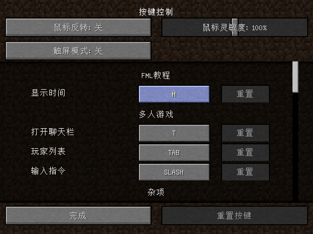

## 概述

这一部分，作者将带领大家完成热键绑定的操作。在操作前，读者需要记住一点：**所有和热键绑定相关的操作都只在客户端执行。**

## KeyBinding

我们在包`com.github.ustc_zzzz.fmltutor.client`下新建一个文件`KeyLoader.java`：

**`src/main/java/com/github/ustc_zzzz/fmltutor/client/KeyLoader.java:`**

    package com.github.ustc_zzzz.fmltutor.client;
    
    import net.minecraft.client.settings.KeyBinding;
    import net.minecraftforge.fml.client.registry.ClientRegistry;
    import org.lwjgl.input.Keyboard;
    
    public class KeyLoader
    {
        public static KeyBinding showTime;
    
        public KeyLoader()
        {
            KeyLoader.showTime = new KeyBinding("key.fmltutor.showTime", Keyboard.KEY_H, "key.categories.fmltutor");
    
            ClientRegistry.registerKeyBinding(KeyLoader.showTime);
        }
    }

然后我们在`ClientProxy`下注册：

**`src/main/java/com/github/ustc_zzzz/fmltutor/client/ClientProxy.java（部分）:`**

        @Override
        public void init(FMLInitializationEvent event)
        {
            super.init(event);
            new ItemRenderLoader();
            new KeyLoader();
        }

现在解释一下上面的代码。

首先，我们先定义一个`KeyBinding`，我们看一看`KeyBinding`的构造方法：

        public KeyBinding(String description, int keyCode, String category) {...}

* `description`参数表示这个键的介绍。
* `keyCode`参数表示这个键的默认键名。这里是H。
* `category`参数表示这个键所在的键类别。

我们修改一下语言文件：

**`src/main/resources/assets/fmltutor/lang/en_US.lang（部分）:`**

    key.fmltutor.showTime=Show Time
    
    key.categories.fmltutor=FML Tutor

**`src/main/resources/assets/fmltutor/lang/zh_CN.lang（部分）:`**

    key.fmltutor.showTime=显示时间
    
    key.categories.fmltutor=FML教程

然后我们使用`ClientRegistry`的`registerKeyBinding`方法注册。

打开游戏，进入控制设置，我们就可以看到我们注册到的`KeyBinding`了：

## 使绑定的热键产生作用

我们在注册的事件中加入监听按键按下的事件：

**`src/main/java/com/github/ustc_zzzz/fmltutor/common/EventLoader.java（部分）:`**
    
        @SideOnly(Side.CLIENT)
        @SubscribeEvent
        public void onKeyInput(InputEvent.KeyInputEvent event)
        {
            if (KeyLoader.showTime.isPressed())
            {
                EntityPlayer player = Minecraft.getMinecraft().thePlayer;
                World world = Minecraft.getMinecraft().theWorld;
                player.addChatMessage(new ChatComponentTranslation("chat.fmltutor.time", world.getTotalWorldTime()));
            }
        }

上面这段代码的作用，就是当键被按下的时候，如果检测到刚才我们注册的`KeyBinding`使用的键被按下，就向游戏控制台输入世界当前的总时间，也就是从世界创始以来的时间。

`ChatComponentTranslation`这个类的作用，就是把语言文件对应的信息翻译掉，翻译的本质方式是`String`类的`format`方法，也就是说，首先Minecraft会从对应的语言文件中获取`ChatComponentTranslation`类的第一个参数对应的内容，然后调用`String`类的`format`方法，使用后面的参数替换前面的格式符，比如`%s`（字符串），`%d`（整数）等。

所以我们现在更新一下语言文件：

**`src/main/resources/assets/fmltutor/lang/en_US.lang（部分）:`**

    chat.fmltutor.time=The total world time is: %s.

**`src/main/resources/assets/fmltutor/lang/zh_CN.lang（部分）:`**

    chat.fmltutor.time=现在时间为：%s。

打开游戏试试吧～
