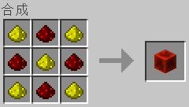
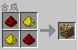

## 什么是矿物字典

我们现在设想这样一种情况，假如你的一个Mod中，需要铜矿这么一种物质，于是你兴冲冲地制作了一个铜矿方块、一个铜锭物品，并且在世界上生成了铜。

这想必是够了吧？且慢！当你的Mod被用于和其他Mod合作的时候，你会发现：

工业Mod（Industrialcraft）也有铜矿、林业Mod（Forestry）也有铜矿、星系Mod（Galacticraft）也有铜矿、热力膨胀（Thermal Expansion）也有铜矿、等等，好多好多Mod都有铜矿，如果你的这个Mod和上面的这四个Mod协作，一下子多出来五种铜矿，随之而来的便是五种铜锭等铜产品。

除此之外，你还发现了一个显而易见的问题，就是这些Mod的铜矿、铜锭等，彼此根本不能相互协作，工业Mod的铜锭不能用来制作星系Mod的发电机，热力膨胀的铜锭也不能参与制作林业Mod的青铜。

Forge提供的矿物字典，就是用来解决上面这些问题的。Forge通过把一些不同Mod常用的物品，映射到一个字符串索引上的方式，统一了各种矿物，除此之外，Forge还提供了一些接口，让Mod可以判断给定的物品，是不是属于一个给定的索引。这些索引的集合，还有其相关的一套识别机制，就是矿物字典。

五种可以相互通用的铜产品，虽然可能还是比较糟糕，但和上面的情况相比就好多了，不是吗？

当然，**矿物字典不只是用于矿物**，**有些重叠率比较高的物品也被注册进了矿物字典**，比如木制品、农作物等等。

## Forge针对原版添加的矿物字典内容

下面列出了一个Forge针对原版添加的矿物字典索引表，供大家参考：

| 索引 | 物品名称 | 索引 | 物品名称 | 索引 | 物品名称 |
|:--------|:------|:--------|:------|:--------|:------|
| logWood | 橡木 | blockGlass | 粉红色染色玻璃 | dye | 黄绿色染料 |
| logWood | 云杉木 | blockGlass | 灰色染色玻璃 | dye | 蒲公英黄 |
| logWood | 白桦木 | blockGlass | 淡灰色染色玻璃 | dye | 淡蓝色染料 |
| logWood | 丛林木 | blockGlass | 青色染色玻璃 | dye | 品红色染料 |
| logWood | 金合欢木 | blockGlass | 紫色染色玻璃 | dye | 橙色染料 |
| logWood | 深色橡木 | blockGlass | 蓝色染色玻璃 | dye | 骨粉 |
| plankWood | 橡木木板 | blockGlass | 棕色染色玻璃 | record | 音乐唱片 |
| plankWood | 云杉木板 | blockGlass | 绿色染色玻璃 | chest | 箱子 |
| plankWood | 白桦木板 | blockGlass | 红色染色玻璃 | chest | 末影箱 |
| plankWood | 丛林木板 | blockGlass | 黑色染色玻璃 | chest | 陷阱箱 |
| plankWood | 金合欢木板 | paneGlassColorless | 玻璃板 | chestWood | 箱子 |
| plankWood | 深色橡木木板 | paneGlass | 玻璃板 | chestEnder | 末影箱 |
| slabWood | 橡木台阶 | paneGlass | 白色染色玻璃板 | chestTrapped | 陷阱箱 |
| slabWood | 云杉台阶 | paneGlass | 橙色染色玻璃板 | dyeBlack | 墨囊 |
| slabWood | 白桦台阶 | paneGlass | 品红色染色玻璃板 | dyeRed | 玫瑰红 |
| slabWood | 丛林台阶 | paneGlass | 淡蓝色染色玻璃板 | dyeGreen | 仙人掌绿 |
| slabWood | 金合欢台阶 | paneGlass | 黄色染色玻璃板 | dyeBrown | 可可豆 |
| slabWood | 深色橡木台阶 | paneGlass | 黄绿色染色玻璃板 | dyeBlue | 青金石 |
| stairWood | 橡木楼梯 | paneGlass | 粉红色染色玻璃板 | dyePurple | 紫色染料 |
| stairWood | 云杉楼梯 | paneGlass | 灰色染色玻璃板 | dyeCyan | 青色染料 |
| stairWood | 白桦楼梯 | paneGlass | 淡灰色染色玻璃板 | dyeLightGray | 淡灰色染料 |
| stairWood | 丛林楼梯 | paneGlass | 青色染色玻璃板 | dyeGray | 灰色染料 |
| stairWood | 金合欢楼梯 | paneGlass | 紫色染色玻璃板 | dyePink | 粉红色染料 |
| stairWood | 深色橡木楼梯 | paneGlass | 蓝色染色玻璃板 | dyeLime | 黄绿色染料 |
| stickWood | 木棍 | paneGlass | 棕色染色玻璃板 | dyeYellow | 蒲公英黄 |
| treeSapling | 橡木树苗 | paneGlass | 绿色染色玻璃板 | dyeLightBlue | 淡蓝色染料 |
| treeSapling | 云杉树苗 | paneGlass | 红色染色玻璃板 | dyeMagenta | 品红色染料 |
| treeSapling | 白桦树苗 | paneGlass | 黑色染色玻璃板 | dyeOrange | 橙色染料 |
| treeSapling | 丛林树苗 | ingotIron | 铁锭 | dyeWhite | 骨粉 |
| treeSapling | 金合欢树苗 | ingotGold | 金锭 | blockGlassBlack | 黑色染色玻璃 |
| treeSapling | 深色橡木树苗 | ingotBrick | 红砖 | blockGlassRed | 红色染色玻璃 |
| treeLeaves | 橡树树叶 | ingotBrickNether | 地狱砖 | blockGlassGreen | 绿色染色玻璃 |
| treeLeaves | 云杉树叶 | nuggetGold | 金粒 | blockGlassBrown | 棕色染色玻璃 |
| treeLeaves | 白桦树叶 | gemDiamond | 钻石 | blockGlassBlue | 蓝色染色玻璃 |
| treeLeaves | 丛林树叶 | gemEmerald | 绿宝石 | blockGlassPurple | 紫色染色玻璃 |
| treeLeaves | 金合欢树叶 | gemQuartz | 下界石英 | blockGlassCyan | 青色染色玻璃 |
| treeLeaves | 深色橡树树叶 | dustRedstone | 红石粉 | blockGlassLightGray | 淡灰色染色玻璃 |
| oreGold | 金矿石 | dustGlowstone | 萤石粉 | blockGlassGray | 灰色染色玻璃 |
| oreIron | 铁矿石 | gemLapis | 青金石 | blockGlassPink | 粉红色染色玻璃 |
| oreLapis | 青金石矿石 | slimeball | 粘液球 | blockGlassLime | 黄绿色染色玻璃 |
| oreDiamond | 钻石矿石 | glowstone | 萤石 | blockGlassYellow | 黄色染色玻璃 |
| oreRedstone | 红石矿石 | cropWheat | 小麦 | blockGlassLightBlue | 淡蓝色染色玻璃 |
| oreEmerald | 绿宝石矿石 | cropPotato | 马铃薯 | blockGlassMagenta | 品红色染色玻璃 |
| oreQuartz | 下界石英矿石 | cropCarrot | 胡萝卜 | blockGlassOrange | 橙色染色玻璃 |
| oreCoal | 煤矿石 | stone | 石头 | blockGlassWhite | 白色染色玻璃 |
| blockGold | 金块 | cobblestone | 圆石 | paneGlassBlack | 黑色染色玻璃板 |
| blockIron | 铁块 | sandstone | 沙石 | paneGlassRed | 红色染色玻璃板 |
| blockLapis | 青金石块 | sandstone | 錾制沙石 | paneGlassGreen | 绿色染色玻璃板 |
| blockDiamond | 钻石块 | sandstone | 平滑沙石 | paneGlassBrown | 棕色染色玻璃板 |
| blockRedstone | 红石块 | sand | 沙子 | paneGlassBlue | 蓝色染色玻璃板 |
| blockEmerald | 绿宝石块 | sand | 红沙 | paneGlassPurple | 紫色染色玻璃板 |
| blockQuartz | 下界石英块 | dye | 墨囊 | paneGlassCyan | 青色染色玻璃板 |
| blockCoal | 煤块 | dye | 玫瑰红 | paneGlassLightGray | 淡灰色染色玻璃板 |
| blockGlassColorless | 玻璃 | dye | 仙人掌绿 | paneGlassGray | 灰色染色玻璃板 |
| blockGlass | 玻璃 | dye | 可可豆 | paneGlassPink | 粉红色染色玻璃板 |
| blockGlass | 白色染色玻璃 | dye | 青金石 | paneGlassLime | 黄绿色染色玻璃板 |
| blockGlass | 橙色染色玻璃 | dye | 紫色染料 | paneGlassYellow | 黄色染色玻璃板 |
| blockGlass | 品红色染色玻璃 | dye | 青色染料 | paneGlassLightBlue | 淡蓝色染色玻璃板 |
| blockGlass | 淡蓝色染色玻璃 | dye | 淡灰色染料 | paneGlassMagenta | 品红色染色玻璃板 |
| blockGlass | 黄色染色玻璃 | dye | 灰色染料 | paneGlassOrange | 橙色染色玻璃板 |
| blockGlass | 黄绿色染色玻璃 | dye | 粉红色染料 | paneGlassWhite | 白色染色玻璃板 |

当然，细心的读者可能注意到了，Forge并没有把1.8新添加的物品，比如海晶石等，注册入矿物字典，这一点可能在未来的版本会被修复。

除了一个矿物字典索引可以用于注册多个物品外，一个物品也可以被注册到多个矿物字典索引上，比如青金石，就同时有着“gemLapis”、“dye”、和“dyeBlue”三个矿物字典索引。

显而易见，注册一个矿物字典使用的索引应该是采用小写驼峰式，第一个词表示这个物品的类型，比如“block”（方块）、“ingot”（锭）、“crop”（农作物）、等等。

那么，回到这一部分最开始的问题，如果我们想要注册铜产品，显而易见，铜矿的矿物字典名称是“oreCopper”、铜锭的是“ingotCopper”，其他的铜产品依此类推。

不过，限于篇幅，这一部分不会制作新的物品或者方块，作者将通过萤石粉和红石粉在矿物字典中的注册，来讲解矿物字典的使用。

## 注册和使用矿物字典

Forge的几乎所有和矿物字典相关的方法，都在`OreDictionary`类中，作为`OreDictionary`类的静态方法。

首当其冲的便是`registerOre`方法，这个方法有两个参数，第一个参数是一个字符串，表示该物品想要被注册到的矿物字典索引名称，第二个参数，就是想要注册到矿物字典的物品了。

用于获取同一矿物字典索引下的所有物品的方法，就是`getOres`方法了，这个方法接受一个表示矿物字典索引的字符串作为参数，返回的是一个包含同一矿物字典索引下的所有物品的列表。

还有一个名为`getOreNames`的方法，这个方法返回一个字符串数组，其中包含了所有的矿物字典索引。

上面这三个方法，应当是属于最常用的和矿物字典相关的方法了。

在包`com.github.ustc_zzzz.fmltutor.common`下新建一个文件`OreDictionaryLoader.java`：

**`src/main/java/com/github/ustc_zzzz/fmltutor/common/OreDictionaryLoader.java:`**

    package com.github.ustc_zzzz.fmltutor.common;
    
    import java.util.List;
    
    import net.minecraft.item.ItemStack;
    import net.minecraftforge.fml.common.event.FMLPreInitializationEvent;
    import net.minecraftforge.oredict.OreDictionary;
    
    public class OreDictionaryLoader
    {
        public OreDictionaryLoader(FMLPreInitializationEvent event)
        {
            List<ItemStack> dustRedstones = OreDictionary.getOres("dustRedstone");
            List<ItemStack> dustGlowstones = OreDictionary.getOres("dustGlowstone");
            for (ItemStack itemStack : dustGlowstones)
            {
                OreDictionary.registerOre("dustRedstone", itemStack);
            }
            for (ItemStack itemStack : dustRedstones)
            {
                OreDictionary.registerOre("dustGlowstone", itemStack);
            }
        }
    }

我们取出了所有注册进矿物字典的红石粉，并把其注册进了萤石粉的矿物字典，取出了所有注册进矿物字典的萤石粉，并把其注册进了红石粉的矿物字典。

然后我们在`CommonProxy`的`preInit`阶段注册：

**`src/main/java/com/github/ustc_zzzz/fmltutor/common/CommonProxy.java（部分）:`**
    
        public void preInit(FMLPreInitializationEvent event)
        {
            new ConfigLoader(event);
            new CreativeTabsLoader(event);
            new ItemLoader(event);
            new BlockLoader(event);
            new OreDictionaryLoader(event);
            new PotionLoader(event);
        }

现在打开游戏，我们可以注意到，下面的情景都发生了：

（第一个图中萤石粉是作为红石粉的矿物字典参与合成的，第二个图中红石粉是作为萤石粉的矿物字典参与合成的）

## 将矿物字典参与合成

我们注意到，在之前部分新添加的红石苹果、红石工具、以及红石盔甲，都不能使用萤石粉来替代红石粉，还好Forge提供了两个类：`ShapedOreRecipe`和`ShapelessOreRecipe`，使用方法很简单，这两个类的构造方法的参数和向`GameRegistry.addShapedRecipe`和`GameRegistry.addShapelessRecipe`方法提供的参数类似，只不过把矿物字典部分换成了作为字符串的矿物字典索引，然后把`ShapedOreRecipe`和`ShapelessOreRecipe`两个类的实例作为`GameRegistry.addRecipe`的参数传入即可。

我们更改一下之前建立的合成表：

**`src/main/java/com/github/ustc_zzzz/fmltutor/crafting/CraftingLoader.java（部分）:`**

            GameRegistry.addRecipe(new ShapedOreRecipe(new ItemStack(ItemLoader.redstonePickaxe), new Object[]
            {
                    "###", " * ", " * ", '#', "dustRedstone", '*', "stickWood"
            }));
            GameRegistry.addRecipe(new ShapedOreRecipe(new ItemStack(ItemLoader.redstoneApple), new Object[]
            {
                    "###", "#*#", "###", '#', "dustRedstone", '*', Items.apple
            }));
            GameRegistry.addRecipe(new ShapedOreRecipe(new ItemStack(ItemLoader.redstoneHelmet), new Object[]
            {
                    "###", "# #", '#', "dustRedstone"
            }));
            GameRegistry.addRecipe(new ShapedOreRecipe(new ItemStack(ItemLoader.redstoneChestplate), new Object[]
            {
                    "# #", "###", "###", '#', "dustRedstone"
            }));
            GameRegistry.addRecipe(new ShapedOreRecipe(new ItemStack(ItemLoader.redstoneLeggings), new Object[]
            {
                    "###", "# #", "# #", '#', "dustRedstone"
            }));
            GameRegistry.addRecipe(new ShapedOreRecipe(new ItemStack(ItemLoader.redstoneBoots), new Object[]
            {
                    "# #", "# #", '#', "dustRedstone"
            }));

顺道把下面这个也改了：

**`src/main/java/com/github/ustc_zzzz/fmltutor/crafting/CraftingLoader.java（部分）:`**

            GameRegistry.addRecipe(new ShapedOreRecipe(new ItemStack(ItemLoader.goldenEgg), new Object[]
            {
                    "###", "#*#", "###", '#', "ingotGold", '*', Items.egg
            }));

现在我们可以向红石粉产品的合成中，加入任意多的萤石粉了。
