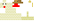
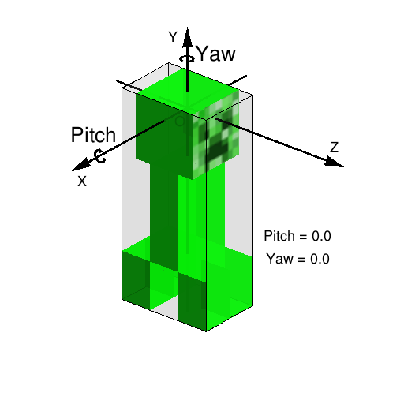
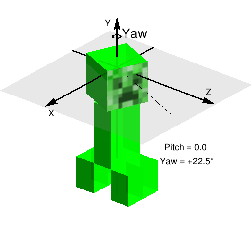
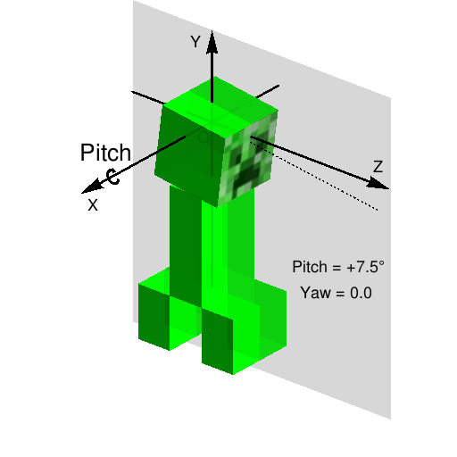
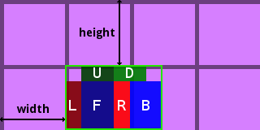
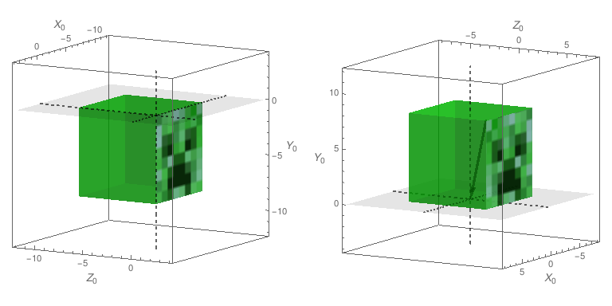
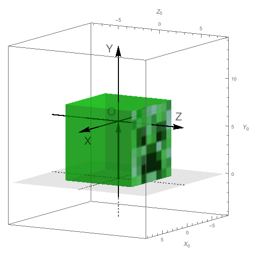

## 概述

来到这一部分，我们进入了一个Minecraft中比较振奋人心，也比较难的地方，也就是生物的渲染模型。

在这里，我们可以令人振奋地做出新的生物模型，做出和别人与众不同的实体生物外观来。

不过，需要注意的是，这一部分会讲到相当多的空间变换等知识，如果读者在理解上有困难的话，建议部分内容多读几遍。

## `Render`类

新建包`com.github.ustc_zzzz.fmltutor.client.entity`，并在其下新建一个文件`EntityRenderLoader.java`：

**`src/main/java/com/github/ustc_zzzz/fmltutor/client/entity/EntityRenderLoader.java:`**

    package com.github.ustc_zzzz.fmltutor.client.entity;
    
    import com.github.ustc_zzzz.fmltutor.entity.EntityLoader;
    
    public class EntityRenderLoader
    {
        public EntityRenderLoader()
        {
            EntityLoader.registerRenders();
        }
    }

对应的调整：

**`src/main/java/com/github/ustc_zzzz/fmltutor/entity/EntityLoader.java（部分）:`**

        @SideOnly(Side.CLIENT)
        public static void registerRenders()
        {
            // TODO
        }
    
        @SideOnly(Side.CLIENT)
        private static <T extends Entity> void registerEntityRender(Class<T> entityClass, Class<? extends Render<T>> render)
        {
            RenderingRegistry.registerEntityRenderingHandler(entityClass, new EntityRenderFactory<T>(render));
        }

放在`ClientProxy`的**`preInit`**阶段注册：

**`src/main/java/com/github/ustc_zzzz/fmltutor/client/ClientProxy.java（部分）:`**

        @Override
        public void preInit(FMLPreInitializationEvent event)
        {
            super.preInit(event);
            new ItemRenderLoader();
            new EntityRenderLoader();
        }

贴完了这些代码，现在我们回到正题上来。我们注意到，我们这里需要使用`RenderingRegistry`的`registerEntityRenderingHandler`方法来注册实体的渲染。

这个方法一共只有两个参数，第一个参数表示这个实体对应的class实例，第二个参数需要一个`IRenderFactory`接口的实例，我们现在去实现它。

在包`com.github.ustc_zzzz.fmltutor.client.entity`下新建一个文件`EntityRenderFactory.java`：

**`src/main/java/com/github/ustc_zzzz/fmltutor/client/entity/EntityRenderFactory.java:`**

    package com.github.ustc_zzzz.fmltutor.client.entity;
    
    import net.minecraft.client.renderer.entity.Render;
    import net.minecraft.client.renderer.entity.RenderManager;
    import net.minecraft.entity.Entity;
    import net.minecraftforge.fml.client.registry.IRenderFactory;
    
    public class EntityRenderFactory<E extends Entity> implements IRenderFactory<E>
    {
        private final Class<? extends Render<E>> renderClass;
    
        public EntityRenderFactory(Class<? extends Render<E>> renderClass)
        {
            this.renderClass = renderClass;
        }
    
        @Override
        public Render<E> createRenderFor(RenderManager manager)
        {
            try
            {
                return renderClass.getConstructor(RenderManager.class).newInstance(manager);
            }
            catch (Exception e)
            {
                throw new RuntimeException(e);
            }
        }
    }

`EntityRenderFactory`类的作用是传入一个`Class`类的实例，去调用它代表的类的一个传入`RenderManager`的构造方法生成。读者不需要关心下面这段代码的含义是什么，直接拿来用，并**保证传入的`Class`类的实例代表的类有一个传入`RenderManager`的构造方法**就可以了。

现在我们可以拿来用了：

**`src/main/java/com/github/ustc_zzzz/fmltutor/entity/EntityLoader.java（部分）:`**

        @SideOnly(Side.CLIENT)
        public static void registerRenders()
        {
            registerEntityRender(EntityGoldenChicken.class, RenderGoldenChicken.class);
        }

新建包`com.github.ustc_zzzz.fmltutor.client.entity.render`，并在其下新建一个`RenderGoldenChicken`类：

**`src/main/java/com/github/ustc_zzzz/fmltutor/client/entity/render/RenderGoldenChicken.java:`**

    package com.github.ustc_zzzz.fmltutor.client.entity.render;
    
    import com.github.ustc_zzzz.fmltutor.FMLTutor;
    import com.github.ustc_zzzz.fmltutor.entity.EntityGoldenChicken;
    
    import net.minecraft.client.model.ModelChicken;
    import net.minecraft.client.renderer.GlStateManager;
    import net.minecraft.client.renderer.entity.RenderLiving;
    import net.minecraft.client.renderer.entity.RenderManager;
    import net.minecraft.util.ResourceLocation;
    import net.minecraftforge.fml.relauncher.Side;
    import net.minecraftforge.fml.relauncher.SideOnly;
    
    @SideOnly(Side.CLIENT)
    public class RenderGoldenChicken extends RenderLiving<EntityGoldenChicken>
    {
        private static final ResourceLocation GOLDEN_CHICKEN_TEXTURE = new ResourceLocation(
                FMLTutor.MODID + ":" + "textures/entity/golden_chicken.png");
    
        public RenderGoldenChicken(RenderManager renderManager)
        {
            super(renderManager, new ModelChicken(), 0.5F);
        }
    
        @Override
        protected void preRenderCallback(EntityGoldenChicken entity, float partialTickTime)
        {
            GlStateManager.scale(2.5F, 2.5F, 2.5F);
        }
    
        @Override
        protected ResourceLocation getEntityTexture(EntityGoldenChicken entity)
        {
            return RenderGoldenChicken.GOLDEN_CHICKEN_TEXTURE;
        }
    
        @Override
        public void doRender(EntityGoldenChicken entity, double x, double y, double z, float entityYaw, float partialTicks)
        {
            super.doRender(entity, x, y, z, entityYaw, partialTicks);
        }
    }

`Render`类的核心，就在于最后的这个名为`doRender`的方法，这个方法传入了实体的坐标和转动角度，总共四个自由度对于渲染一个实体来说是足够用了。那么这个partialTicks是怎么回事呢？

我们知道，在包括Minecraft在内的许多游戏中，游戏逻辑循环和渲染循环是相对独立的，毕竟在Minecraft中是每秒钟实现二十次逻辑，而如果游戏的渲染帧率只有20每秒的话，很多人的需求是无法被满足，所以说在游戏中的中间的部分的渲染，就要进行平滑的插值来完成，比如说实体0tick时在位置0，1tick时在位置1,那么在0.5tick时（这时游戏还没有实现下一次逻辑！）的位置就应该是“(位置0+位置1)/2”，这是非常显而易见的，这里的`partialTicks`，就是tick数的小数部分。其实这里传入的四个坐标和姿态参数，就是这么算出来的。不过对于实现一些逻辑还是不太够，这里就把`partialTicks`一并传过来，供这个方法使用。

这里我们尽可以覆写这个方法，甚至不依靠`RenderLiving`类，直接继承`Render`类并覆写，完成对实体的渲染，不过如果直接进行实体的渲染的话，那实在是太复杂了。不过幸运的是，Minecraft游戏本身提供了一些轮子，来帮助我们完成实体的渲染。在很多时候，我们可能只需要渲染若干个经过平移和旋转的长方体，就足够了。

我们现在把目光投向这个类的构造方法：

**`src/main/java/com/github/ustc_zzzz/fmltutor/client/entity/render/RenderGoldenChicken.java（部分）:`**

        public RenderGoldenChicken(RenderManager renderManager)
        {
            super(renderManager, new ModelChicken(), 0.5F);
        }

第一个参数表示的是Minecraft的渲染管理器，这里留作参数传入就可以了，我们刚刚也注意到了，在注册的时候，这确实作为参数，把`Minecraft.getMinecraft().getRenderManager()`传入了这个类的构造方法。第三个参数其实表示的是阴影大小，这里用默认的0.5就可以了。

第二个参数表示的，就是这个实体生物的实体渲染模型了，这里我们暂时会先用鸡的渲染模型代替，在稍后我们会讲到如何去自定义这个模型，这其实也是这一部分的重点。

现在我们再把目光投向其他方法。首先我们讨论到了这个名为`doRender`的方法，不过这个方法一般我们不会去动它，这是因为这个方法，父类已经做得足够完善了。一个可定制的方式，就是这里的一个名为`preRenderCallback`的方法。

这里我们可以加一些我们想要的变换操作，比如在原版游戏中，史莱姆的大小设置、爬行者在爆炸前会变得稍稍大些，等等，都是通过覆写这个方法设置的。这里我们加一点有趣的特性：

**`src/main/java/com/github/ustc_zzzz/fmltutor/client/entity/render/RenderGoldenChicken.java（部分）:`**

        protected void preRenderCallbackGoldenChicken(EntityGoldenChicken entity, float partialTickTime)
        {
            GlStateManager.scale(2.5F, 2.5F, 2.5F);
        }

这只黄金鸡就被放大成了原来的2.5倍。

这里还有一个比较重要的需要覆写的方法没有讲，这个方法指定了渲染的材质：

**`src/main/java/com/github/ustc_zzzz/fmltutor/client/entity/render/RenderGoldenChicken.java（部分）:`**

        @Override
        protected ResourceLocation getEntityTexture(Entity entity)
        {
            return RenderGoldenChicken.GOLDEN_CHICKEN_TEXTURE;
        }

**`src/main/java/com/github/ustc_zzzz/fmltutor/client/entity/render/RenderGoldenChicken.java（部分）:`**

        private static final ResourceLocation GOLDEN_CHICKEN_TEXTURE = new ResourceLocation(
                FMLTutor.MODID + ":" + "textures/entity/golden_chicken.png");

好了，现在我们可以新建一个文件夹：`src/main/resources/assets/fmltutor/textures/entity/`，并放入一个名为`golden_chicken.png`的贴图了：

**`src/main/resources/assets/fmltutor/textures/entity/golden_chicken.png:`**

经过作者的调色，读者一定可以想象到，这只黄金鸡全身上下，都将散发着金色的光辉。

## 实体生物的内禀运动属性

这里我们以爬行者为例，来讲解实体生物的内禀运动属性。这一部分的内容对于从未接触过相关方面的读者来说可能有些艰深晦涩，如果感觉有的部分难以理解，可以考虑把这一部分重新阅读一遍。

在之前的部分中作者曾经提到过，实体的运动属性包括三个位置坐标和两个姿态坐标，通过这五个坐标，我们就可以确定一个爬行者的身体，在游戏中是什么样子的。但是站在渲染的角度上，这真的够了吗？答案显然是否定的，爬行者的头部还可以旋转，四条腿还可以移动。可能在实体的逻辑上来说这并没有什么意义，如果我们要写一个爬行者的行走或爆炸的AI，考虑它的四条腿怎么摆动自然没有什么必要。

同样，在渲染的时候，如果我们始终让这个爬行者的身体冲向我们，那么，爬行者的三个位置坐标和两个姿态坐标，也就可以被方便地忽略掉了，至少在这种情况下，这五个描述爬行者外部运动坐标是没有意义的。所以我们完全可以把这些运动属性从三个位置坐标和两个姿态坐标中分离，并独立出来，这些属性就被称为一个物体的内禀运动属性。

Minecraft把一个实体生物的内禀运动属性简化成了五个量，其中三个是和四肢运动相关，这里我们暂时搁下，先来讨论剩下的两个和头部运动相关的量。

首先，我们要规定一个内禀坐标系，Minecraft约定，如果我们正对着这个实体的身体的话，这个坐标系的Z轴朝向实体身体的正前方，也就是垂直屏幕向外，Y轴向上，X轴向左。这里我们如果使用爬行者举例的话就是这个样子的了：

如果读者有学过空间几何的话可能就注意到了，这个坐标系，和我们平常使用的坐标系不太一样，是一个左手系，而我们平常使用的是右手系。

那么什么是左手系，什么是右手系呢？现在我们伸出自己的右手，并使得大拇指、食指、中指以最自然的方式相互垂直，现在我们使大拇指贴合X轴，食指贴合Y轴，如果这时中指指向的方向正好是Z轴的方向的话，我们就认为这三个坐标轴所构成的空间坐标系，是右手系，如果使用右手不能贴合，使用左手却可以的话，那么就是左手系。在日常生活和绝大部分的科学研究中，我们使用的都是右手系，但遗憾的是，因为Minecraft使用的OpenGL，也就是底层的图形库的版本缘故，**在Minecraft中，我们使用的是左手系**。

细心的读者可能已经注意到了，刚刚的图已经把头部运动的两个相关的量表示出来了，这里我们就讲一下三种类型的旋转的概念。

这三种类型的旋转分别叫做Pitch、Yaw、和Roll，它们都等同于以某个坐标轴为旋转轴的旋转，这里没有比较好的对应中文词，所以作者就直接使用英文表示了。这里我们可以想象一架在空中飞行的飞机，它在起飞的时候会机头上仰，在降落的时候会机头下压，这种方向的旋转我们称其为Pitch，飞机在飞行的时候会有航向，也就是东南西北方向，这个方向的旋转我们称其为Yaw，飞机在调整左右平衡的时候，机翼会向左向右倾斜，这种方向的旋转我们称其为Roll。

关于这三种旋转类型有一个约定，也就是**Pitch表示X轴方向的旋转，Yaw表示Y轴，Roll表示Z轴**。所以我们可以注意到，不管是爬行者，还是飞机，坐标轴方向其实都是差不多的，不过因为飞机上使用的是右手系，X轴的方向是和图中爬行者对应的X轴的方向是相反的。

那么现在三种旋转的类型已经定下来了，方向呢？我们都知道旋转是分顺时针和逆时针的，这里我们自然是非常有必要规定哪个是正的，哪个是负的。这里的约定也非常自然：**Pitch中Y轴向Z轴旋转的方向为正，Yaw中Z轴向X轴旋转的方向为正，Roll中X轴向Y轴旋转的方向为正**。如果在Minecraft提供的左手系中，就是：**逆着坐标轴指向的方向看去，顺时针为正，逆时针为负**。在上面的图中，已经用箭头指出了旋转的正方向，也就是**头部向右旋转为正，向左为负**，和**头部俯视为正，仰视为负**。

因为在一个实体生物中，不会有头部左右摆动的现象出现，所以说并不会出现Roll这一参数，不过Minecraft还是提供了Yaw，也就是以Y轴为旋转轴的旋转参数：

和Pitch，也就是以X轴为旋转轴的旋转参数：

现在我们可以看看`ModelCreeper`类了。我们注意到，作为`ModelBase`类的子类，这个类覆写了`render`和`setRotationAngles`方法，很明显，在我们的实体生物模型中，也要覆写这两个方法。我们注意到前者的第一个参数和后者的最后一个参数是一致的，都表示了这个实体本身，除去这个参数，剩下的六个参数，两个方法也是一致的。

        public void render(Entity p_78088_1_, float p_78088_2_, float p_78088_3_, float p_78088_4_, float p_78088_5_, float p_78088_6_, float p_78088_7_)
        {
            this.setRotationAngles(p_78088_2_, p_78088_3_, p_78088_4_, p_78088_5_, p_78088_6_, p_78088_7_, p_78088_1_);
            this.head.render(p_78088_7_);
            this.body.render(p_78088_7_);
            this.leg1.render(p_78088_7_);
            this.leg2.render(p_78088_7_);
            this.leg3.render(p_78088_7_);
            this.leg4.render(p_78088_7_);
        }

我们注意到，这个被覆写的方法的意思其实很明显，就是先设定爬行者旋转的角度，然后把组成爬行者的六个方块挨个渲染一次。所以这里`render`方法提供的最后一个参数，其实是和剩下五个表示的含义不大一样的，实际上，这个参数表示的其实是实体的尺寸。这个参数几科所有情况下都是1/16，表示实体的一格单位，为方块的一格的十六分之一，所以这里我们暂且不关心它，因为这个尺寸参数其实不常用。

我们先来看一看`setRotationAngles`方法：

        public void setRotationAngles(float p_78087_1_, float p_78087_2_, float p_78087_3_, float p_78087_4_, float p_78087_5_, float p_78087_6_, Entity p_78087_7_)
        {
            this.head.rotateAngleY = p_78087_4_ / (180F / (float)Math.PI);
            this.head.rotateAngleX = p_78087_5_ / (180F / (float)Math.PI);
            this.leg1.rotateAngleX = MathHelper.cos(p_78087_1_ * 0.6662F) * 1.4F * p_78087_2_;
            this.leg2.rotateAngleX = MathHelper.cos(p_78087_1_ * 0.6662F + (float)Math.PI) * 1.4F * p_78087_2_;
            this.leg3.rotateAngleX = MathHelper.cos(p_78087_1_ * 0.6662F + (float)Math.PI) * 1.4F * p_78087_2_;
            this.leg4.rotateAngleX = MathHelper.cos(p_78087_1_ * 0.6662F) * 1.4F * p_78087_2_;
        }

前两句立刻指明了两个参数的作用：

            this.head.rotateAngleY = p_78087_4_ / (180F / (float)Math.PI);
            this.head.rotateAngleX = p_78087_5_ / (180F / (float)Math.PI);

也就是刚刚我在上面说的那两个参数嘛，现在我们得出结论，第四个参数表示头部旋转的Yaw值，第五个表示Pitch值。

前三个参数不容易推断，这里作者直接向读者展明：

* 第一个参数表示这个实体生物运动的四肢的量，可以初步理解为和实体运动的路程成正相关，也就是说，这个数字在不断得变大，然而实体的四肢是不断摆动的，所以在这里我们需要使用三角函数来限定一下范围，就可以表现出实体四肢摆动的周期性了
* 第二个参数表示这个实体生物运动的四肢的速度，也就是每一个gametick上一个参数变化的量，这个参数可以表征实体生物的运动速度，不过有着一定的滞回性，想象一个在很快速地行走的玩家突然停了下来，他的四肢其实还是在不断地摆动，并且在不断地衰减，所以这个参数可以直接用来限制实体生物四肢摆动的幅度
* 第三个参数表示实体四肢的固有摆动，其实这也是一个慢慢增大的量，如果没有特殊处理，其大小上等于实体存活的gametick数，当然因为渲染是单独执行的，这个数不见得是整数，实体四肢的固有摆动包括但不限于恶魂的九个触手的摆动、烈焰人身上的棒的旋转等

`MathHelper`类是Minecraft提供了一个用于加快三角函数计算的类，可以用这个类加快频繁的三角函数的计算。

            this.leg1.rotateAngleX = MathHelper.cos(p_78087_1_ * 0.6662F) * 1.4F * p_78087_2_;
            this.leg2.rotateAngleX = MathHelper.cos(p_78087_1_ * 0.6662F + (float)Math.PI) * 1.4F * p_78087_2_;
            this.leg3.rotateAngleX = MathHelper.cos(p_78087_1_ * 0.6662F + (float)Math.PI) * 1.4F * p_78087_2_;
            this.leg4.rotateAngleX = MathHelper.cos(p_78087_1_ * 0.6662F) * 1.4F * p_78087_2_;

这里设置了爬行者的四条腿是怎么走动的。

上面这三个参数，和刚刚作者着重强调的两个参数，共同构成了Minecraft简化得到的实体生物的所有内禀运动参数。

## 实体渲染模型

现在终于到了激动人心的，使用自定义模型替换`RenderLiving`类构造方法的第二个参数的时刻，不过在这之前，我们先看一下爬行者的模型，这些模型是在爬行者的构造函数中定义的：

        public ModelRenderer head;
        public ModelRenderer creeperArmor;
        public ModelRenderer body;
        public ModelRenderer leg1;
        public ModelRenderer leg2;
        public ModelRenderer leg3;
        public ModelRenderer leg4;

        public ModelCreeper()
        {
            this(0.0F);
        }
    
        public ModelCreeper(float p_i46366_1_)
        {
            byte b0 = 6;
            this.head = new ModelRenderer(this, 0, 0);
            this.head.addBox(-4.0F, -8.0F, -4.0F, 8, 8, 8, p_i46366_1_);
            this.head.setRotationPoint(0.0F, (float)b0, 0.0F);
            this.creeperArmor = new ModelRenderer(this, 32, 0);
            this.creeperArmor.addBox(-4.0F, -8.0F, -4.0F, 8, 8, 8, p_i46366_1_ + 0.5F);
            this.creeperArmor.setRotationPoint(0.0F, (float)b0, 0.0F);
            this.body = new ModelRenderer(this, 16, 16);
            this.body.addBox(-4.0F, 0.0F, -2.0F, 8, 12, 4, p_i46366_1_);
            this.body.setRotationPoint(0.0F, (float)b0, 0.0F);
            this.leg1 = new ModelRenderer(this, 0, 16);
            this.leg1.addBox(-2.0F, 0.0F, -2.0F, 4, 6, 4, p_i46366_1_);
            this.leg1.setRotationPoint(-2.0F, (float)(12 + b0), 4.0F);
            this.leg2 = new ModelRenderer(this, 0, 16);
            this.leg2.addBox(-2.0F, 0.0F, -2.0F, 4, 6, 4, p_i46366_1_);
            this.leg2.setRotationPoint(2.0F, (float)(12 + b0), 4.0F);
            this.leg3 = new ModelRenderer(this, 0, 16);
            this.leg3.addBox(-2.0F, 0.0F, -2.0F, 4, 6, 4, p_i46366_1_);
            this.leg3.setRotationPoint(-2.0F, (float)(12 + b0), -4.0F);
            this.leg4 = new ModelRenderer(this, 0, 16);
            this.leg4.addBox(-2.0F, 0.0F, -2.0F, 4, 6, 4, p_i46366_1_);
            this.leg4.setRotationPoint(2.0F, (float)(12 + b0), -4.0F);
        }

首先，我们注意到这个爬行者的身体是由若干个`ModelRenderer`类的实例组成，很明显，这样的一个`ModelRenderer`类的实例，就可以代表一个长方体了。

第一个参数表示这个模型需要从什么地方继承材质，很明显就是目前这个描述爬行者模型的类本身。

那么后面这两个参数表示什么呢？其实表示的是这个长方体的材质在材质图上的位置，也就是分别表示下图中的width和height：

这里的爬行者脑袋的两个值都是0，这就代表这个材质在材质图的左上角。

如无特殊需求，材质图的大小建议为**64x32**，如果因为元素过多不得已需要扩展材质的话，可以考虑设置类的`textureWidth`和`textureHeight`来更改大小。

然后就是令人费解的两句话了：

            this.head.addBox(-4.0F, -8.0F, -4.0F, 8, 8, 8, p_i46366_1_);
            this.head.setRotationPoint(0.0F, (float)b0, 0.0F);

我们这里以爬行者脑袋为例，分析这到底是什么意思。

`addBox`的最后一个参数和这个长方体的尺寸大小有关，这里我们不用管他，设置为零就可以了。

首先，我们假设只保留`addBox`方法的第四、第五、和第六个参数，其他的参数都暂定为零，这时Minecraft规定，长方体的旋转中心点，和长方体的左上前方（也就是XYZ坐标最大的）顶点重合，如果我们以爬行者的旋转中心点为中心建立坐标系的话，就应该是下图中左侧这个样子：

这里的三条虚线表示的是坐标轴，不过因为这个坐标系和刚刚我们提到的内禀坐标系不一样，为防止混淆，这里我们使用X0，Y0，Z0来表示，并写在边框的坐标上。

这三个参数的意义自然已经很明显了，就是长方体的大小嘛（8，8，8）。

现在我们再来看看上图中右侧，这里描述的就是`addBox`方法的前三个参数了，这三个参数表示这个**旋转中心点也就是X0、Y0、Z0所组成坐标系**向一个方向平移了指定的单位，这也等价于当前长方体向指定方向的**反方向**平移了指定的单位，也就是说如果这三个参数不全为负，这个旋转中心点将会在长方体外，上图中右侧的一个箭头表示了`addBox`方法的前三个参数代表的平移（-4，-8，-4）。

有了`addBox`方法的六个参数，这个长方体的大小，和其旋转中心点的相对位置，就已经决定了。现在我们来看`setRotationPoint`方法产生的结果：

我们这里注意到，这里我们就决定了**实体生物的内禀坐标相对于旋转中心点**的位置关系，这其实也等价于旋转中心点从实体生物的内禀坐标原点沿**反方向**平移了指定的单位，现在整个方块相对于实体生物的位置，以及旋转中心的位置，就完全被确定了。同样，图中也有一个箭头表示平移（0，6，6）。

其他的长方体，自然和这个脑袋是一样的，读者可以自己试着推推看。

那么现在又多了一个问题，这个实体生物的内禀坐标系，原点到底在哪里呢？实际上，这个坐标系的原点并不在地面上，而是在地面上方**24个单位**，也就是**1.5个方块高**的地方，虽然这个设计本身有一些缺点，但是这样做无疑有得于运算方便，所以说这个坐标系的原点才会比爬行者的眼睛还要高呢。

在了解了爬行者的模型之后，我们就可以继承`ModelBase`类，如法炮制一个模型了，这里限于篇幅，就不再赘述了。

新建包com.github.ustc_zzzz.fmltutor.client.entity.model`，并在其下新建一个`ModelGoldenChicken`类：

**`src/main/java/com/github/ustc_zzzz/fmltutor/client/entity/model/ModelGoldenChicken.java:`**

    package com.github.ustc_zzzz.fmltutor.client.entity.model;
    
    import net.minecraft.client.model.ModelBase;
    import net.minecraft.client.model.ModelRenderer;
    import net.minecraft.entity.Entity;
    import net.minecraft.util.MathHelper;
    import net.minecraftforge.fml.relauncher.Side;
    import net.minecraftforge.fml.relauncher.SideOnly;
    
    @SideOnly(Side.CLIENT)
    public class ModelGoldenChicken extends ModelBase
    {
        public ModelRenderer head;
        public ModelRenderer bill;
        public ModelRenderer chin;
        public ModelRenderer body;
        public ModelRenderer rightLeg;
        public ModelRenderer leftLeg;
        public ModelRenderer rightWing;
        public ModelRenderer leftWing;
    
        public ModelGoldenChicken()
        {
            this.head = new ModelRenderer(this, 0, 0);
            this.head.addBox(-2.0F, -6.0F, -2.0F, 4, 6, 3, 0.0F);
            this.head.setRotationPoint(0.0F, 15.0F, -4.0F);
            this.bill = new ModelRenderer(this, 14, 0);
            this.bill.addBox(-2.0F, -4.0F, -4.0F, 4, 2, 2, 0.0F);
            this.bill.setRotationPoint(0.0F, 15.0F, -4.0F);
            this.chin = new ModelRenderer(this, 14, 4);
            this.chin.addBox(-1.0F, -2.0F, -3.0F, 2, 2, 2, 0.0F);
            this.chin.setRotationPoint(0.0F, 15.0F, -4.0F);
            this.body = new ModelRenderer(this, 0, 9);
            this.body.addBox(-3.0F, -4.0F, -3.0F, 6, 8, 6, 0.0F);
            this.body.setRotationPoint(0.0F, 16.0F, 0.0F);
            this.rightLeg = new ModelRenderer(this, 26, 0);
            this.rightLeg.addBox(-1.0F, 0.0F, -3.0F, 3, 5, 3);
            this.rightLeg.setRotationPoint(-2.0F, 19.0F, 1.0F);
            this.leftLeg = new ModelRenderer(this, 26, 0);
            this.leftLeg.addBox(-1.0F, 0.0F, -3.0F, 3, 5, 3);
            this.leftLeg.setRotationPoint(1.0F, 19.0F, 1.0F);
            this.rightWing = new ModelRenderer(this, 24, 13);
            this.rightWing.addBox(-0.5F, -0.5F, -1.5F, 1, 4, 6);
            this.rightWing.setRotationPoint(-3.0F, 15.5F, 0.0F);
            this.leftWing = new ModelRenderer(this, 24, 13);
            this.leftWing.addBox(-0.5F, -0.5F, -1.5F, 1, 4, 6);
            this.leftWing.setRotationPoint(3.0F, 15.5F, 0.0F);
        }
    
        @Override
        public void render(Entity entity, float limbSwing, float limbSwingAmount, float rotateFloat, float rotateYaw,
                float rotatePitch, float scale)
        {
            this.setRotationAngles(limbSwing, limbSwingAmount, rotateFloat, rotateYaw, rotatePitch, scale, entity);
            this.head.render(scale);
            this.bill.render(scale);
            this.chin.render(scale);
            this.body.render(scale);
            this.rightLeg.render(scale);
            this.leftLeg.render(scale);
            this.rightWing.render(scale);
            this.leftWing.render(scale);
        }
    
        @Override
        public void setRotationAngles(float limbSwing, float limbSwingAmount, float rotateFloat, float rotateYaw,
                float rotatePitch, float scale, Entity entity)
        {
            this.head.rotateAngleX = rotatePitch / (180F / (float) Math.PI);
            this.head.rotateAngleY = rotateYaw / (180F / (float) Math.PI);
            this.bill.rotateAngleX = this.head.rotateAngleX;
            this.bill.rotateAngleY = this.head.rotateAngleY;
            this.chin.rotateAngleX = this.head.rotateAngleX;
            this.chin.rotateAngleY = this.head.rotateAngleY;
            this.body.rotateAngleX = (float) (Math.PI / 2.0D);
            this.rightLeg.rotateAngleX = MathHelper.cos(limbSwing * 0.6662F) * 1.4F * limbSwingAmount;
            this.leftLeg.rotateAngleX = -MathHelper.cos(limbSwing * 0.6662F) * 1.4F * limbSwingAmount;
            this.rightWing.rotateAngleZ = 1.5F * rotateFloat;
            this.leftWing.rotateAngleZ = -1.5F * rotateFloat;
        }
    }

用自己的模型替换Minecraft原版的模型：

**`src/main/java/com/github/ustc_zzzz/fmltutor/client/entity/render/RenderGoldenChicken.java（部分）:`**

        public RenderGoldenChicken(RenderManager renderManager)
        {
            super(renderManager, new ModelGoldenChicken(), 0.5F);
        }

打开游戏试试吧～

## 使用第三方软件设置实体渲染模型

上面的解读，可能读者会看得一头雾水，确实，这样的设计实在是太困难了，复杂且不论，不够直观才是最要命的。

还好国外两个分别名为Zeux与R4wk的开发者，共同为Minecraft研发了一款名为Techne的建模软件（<http://techne.zeux.me/techne>），可以很方便地，以即时的方式建立一个实体的模型。建立模型后可以直接生成对应的Java代码，这段Java代码只要稍作修改，就可以直接用于Mod的代码中，确实大大方便了实体渲染模型的制作。

当然，Techne相对于中国大陆用户来说有一点不足，就是Techne这款软件的安装依赖一个从Dropbox上下载资源的环节，所以说很有可能会出现安装失败的情况，建议寻找一个较好的网络连接处下载，必要时可使用代理进行尝试。

不过作者在这里要提醒一句，**不要过分依赖这样的第三方辅助软件**，因为这种软件毕竟只是用于建模，真正的逻辑，比如实体生物四肢的摆动，还是要自己完成的，这样做出来的Mod，画面才会更丰富，可玩性才会更高。

实体模型的渲染，就到这里啦～这一部分的内容较多，希望读者可以好好消化下。
