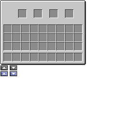
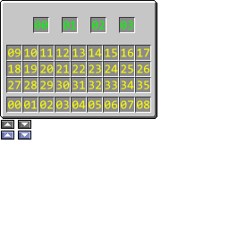
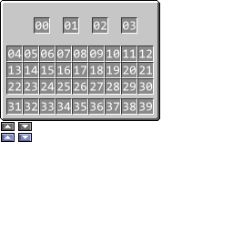
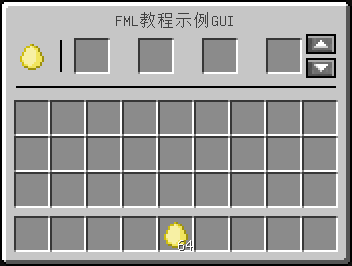

## 概述

在本部分教程中我们可以做到：

* 为GUI添加合适的背景
* 向GUI添加物品槽并使其自动显示在GUI的正确位置上
* 在GUI中绘制横线、竖线、一行文字、以及特定物品
* 在GUI中添加按钮

## GUI的背景

在上一部分的内容中我们说道，GUI的代表，也就是`GuiContainer`类，有两个方法的实现较为重要，它们分别是`drawGuiContainerBackgroundLayer`和`drawGuiContainerForegroundLayer`方法，这两个方法是如何被调用的呢？

一个`GuiContainer`的绘制，一般要经历以下四步：

* 执行`drawGuiContainerBackgroundLayer`方法
* 绘制所有按钮
* 绘制所有物品槽上的物品
* 执行`drawGuiContainerForegroundLayer`方法

中间两步我们是没有必要直接干涉的，所以目前来看，很显而易见地，GUI的背景应该是在第一步绘制，而制横线、竖线、一行文字、以及特定物品等，应该在最后一步绘制。

这里我们就绘制一下背景：

**`src/main/java/com/github/ustc_zzzz/fmltutor/client/gui/GuiContainerDemo.java（部分）:`**

```java
    private static final String TEXTURE_PATH = FMLTutor.MODID + ":" + "textures/gui/container/gui_demo.png";
    private static final ResourceLocation TEXTURE = new ResourceLocation(TEXTURE_PATH);
```

**`src/main/java/com/github/ustc_zzzz/fmltutor/client/gui/GuiContainerDemo.java（部分）:`**

```java
    @Override
    protected void drawGuiContainerBackgroundLayer(float partialTicks, int mouseX, int mouseY)
    {
        GlStateManager.color(1.0F, 1.0F, 1.0F);

        this.mc.getTextureManager().bindTexture(TEXTURE);
        int offsetX = (this.width - this.xSize) / 2, offsetY = (this.height - this.ySize) / 2;

        this.drawTexturedModalRect(offsetX, offsetY, 0, 0, this.xSize, this.ySize);
    }
```

很简单对吧。首先我们要先执行`GlStateManager.color(1.0F, 1.0F, 1.0F)`以确保绘制出来的颜色是正常的，这一步可以不用在意。

然后，我们使用`TextureManager`类的`bindTexture`方法绑定材质，这里的材质使用`ResourceLocation`进行设置，那么这个材质的位置已经很明显了，我们新建文件`assets.fmltutor.textures.gui.container.gui_demo.png`，以完成对于材质的设定：

**`src/main/resources/assets/fmltutor/textures/gui/container/gui_demo.png:`**



这里只有一点需要注意的是**材质的大小必须是256x256**。

然后我们通过调用`drawTexturedModalRect`方法绘制特定材质，下面来解释一下这个方法的六个参数：

* 前两个参数表示绘制的材质在**窗口的左上角**的坐标，又称xy值，我们使用了一种技巧使其位于屏幕正中间
* 中间两个参数表示绘制在材质在**材质图的左上角**的坐标，又称uv值，这里自然都是零
* 最后两个参数表示绘制的矩形的长宽尺寸

这里还有一点需要设置，读者可以注意到，上面的代码出现的四个属性值，其中`this.width`和`this.height`分别代表的是窗口的长和宽，它们是可以被方便确定的，而剩下的`this.xSize`和`this.ySize`分别代表的是GUI界面的长和宽，这两项还是需要手动设置的，我们在构造方法中设置这一点：

**`src/main/java/com/github/ustc_zzzz/fmltutor/client/gui/GuiContainerDemo.java（部分）:`**

```java
    public GuiContainerDemo(ContainerDemo inventorySlotsIn)
    {
        super(inventorySlotsIn);
        this.xSize = 176;
        this.ySize = 133;
    }
```

这得以保证正好是我们想要的GUI界面被渲染进窗口，而不是发生少渲染甚至多渲染（把下面稍后用到的按钮直接渲染进窗口）的情况。

现在打开GUI，理应能够看到界面了，虽然这个界面还什么都不能做。

## GUI的物品槽

因为Mojang独特的设计方式——物品槽的大部分数据，甚至包括其在GUI中的坐标，都是在`Container`中定义的，我们先修改一下`Container`的构造方法，使其可以传入一个`EntityPlayer`：

**`src/main/java/com/github/ustc_zzzz/fmltutor/inventory/ContainerDemo.java（部分）:`**

```java
    public ContainerDemo(EntityPlayer player)
    {
        super();

        // TODO
    }
```
**`src/main/java/com/github/ustc_zzzz/fmltutor/inventory/GuiElementLoader.java（部分）:`**

```java
    @Override
    public Object getServerGuiElement(int ID, EntityPlayer player, World world, int x, int y, int z)
    {
        switch (ID)
        {
        case GUI_DEMO:
            return new ContainerDemo(player);
        default:
            return null;
        }
    }

    @Override
    public Object getClientGuiElement(int ID, EntityPlayer player, World world, int x, int y, int z)
    {
        switch (ID)
        {
        case GUI_DEMO:
            return new GuiContainerDemo(new ContainerDemo(player));
        default:
            return null;
        }
    }
```

然后我们就要使用`addSlotToContainer`方法添加物品槽了，这里先直接把代码贴出来：

**`src/main/java/com/github/ustc_zzzz/fmltutor/inventory/ContainerDemo.java（部分）:`**

```java
    private ItemStackHandler items = new ItemStackHandler(4);

    public ContainerDemo(EntityPlayer player)
    {
        super();

        for (int i = 0; i < 4; ++i)
        {
            this.addSlotToContainer(new SlotItemHandler(items, i, 38 + i * 32, 20));
        }

        for (int i = 0; i < 3; ++i)
        {
            for (int j = 0; j < 9; ++j)
            {
                this.addSlotToContainer(new Slot(player.inventory, j + i * 9 + 9, 8 + j * 18, 51 + i * 18));
            }
        }

        for (int i = 0; i < 9; ++i)
        {
            this.addSlotToContainer(new Slot(player.inventory, i, 8 + i * 18, 109));
        }
    }
```

首先，我们要清楚，所有的`Slot`，都是代表一个可以容纳一个`ItemStack`的物品槽，而可以存放物品槽的对象都有什么呢？一个最常见的就是Minecraft原版提供的`IInventory`，那么我们现在来看一下`Slot`的构造方法：

```java
    public Slot(IInventory inventoryIn, int index, int xPosition, int yPosition) {...}
```

意思已经很明显了，第一个参数代表相关联的`IInventory`，第二个参数代表物品槽在`IInventory`中的ID，最后两个参数代表它在GUI中的坐标。

所以我们首先要明确一下几乎任何一个GUI都会添加的`IInventory`，也就是玩家背包（通过`player.inventory`获取），其中的每一个物品槽的ID是多少（注意下图中的黄色部分）：



从0到35,分别指代了背包中36个物品槽的ID，不过我们还有四个槽没指定呢，我们这里手动指定一下（注意上图中的绿色部分）。

在之前的教程中作者提到过Forge推荐使用`IItemHandler`存储物品，所以这里我们新建了一个拥有四个物品槽的`ItemStackHandler`：

```java
    private ItemStackHandler items = new ItemStackHandler(4);
```

然后我们先把这四个物品槽加入了GUI：

```java
        for (int i = 0; i < 4; ++i)
        {
            this.addSlotToContainer(new SlotItemHandler(items, i, 38 + i * 32, 20));
        }
```

接着把36个玩家背包中的物品槽加入了GUI：

```java
        for (int i = 0; i < 3; ++i)
        {
            for (int j = 0; j < 9; ++j)
            {
                this.addSlotToContainer(new Slot(player.inventory, j + i * 9 + 9, 8 + j * 18, 51 + i * 18));
            }
        }

        for (int i = 0; i < 9; ++i)
        {
            this.addSlotToContainer(new Slot(player.inventory, i, 8 + i * 18, 109));
        }
```

就大功告成了。

这里我们的添加顺序其实指定了另一个ID，这个ID就是`Slot`在这个`Container`中的序号，这里暂时用不到，下一节的教程中会用到，这里提出只是不要希望和上面的ID混淆：



最后，我们还需要覆写一下`transferStackInSlot`方法：

**`src/main/java/com/github/ustc_zzzz/fmltutor/inventory/ContainerDemo.java（部分）:`**

```java
    @Override
    public ItemStack transferStackInSlot(EntityPlayer playerIn, int index)
    {
        return null;
    }
```

这个方法的作用在下一节会讲到，但如果还没有具体设计这一方法，**请务必将其设置为返回null**，否则在测试中可能会遇到一些匪夷所思的问题。

## 在GUI中绘制图形

我们覆写`drawGuiContainerForegroundLayer`方法：

**`src/main/java/com/github/ustc_zzzz/fmltutor/client/gui/GuiContainerDemo.java（部分）:`**

```java
    @Override
    protected void drawGuiContainerForegroundLayer(int mouseX, int mouseY)
    {
        this.drawVerticalLine(30, 19, 36, 0xFF000000);
        this.drawHorizontalLine(8, 167, 43, 0xFF000000);

        String title = I18n.format("container.fmltutor.demo");
        this.fontRendererObj.drawString(title, (this.xSize - this.fontRendererObj.getStringWidth(title)) / 2, 6, 0x404040);

        ItemStack item = new ItemStack(ItemLoader.goldenEgg);
        this.itemRender.renderItemAndEffectIntoGUI(item, 8, 20);
    }
```

这一段简单的代码示例，已经包括了绘制横线、竖线、一行文字、以及特定物品的内容。

首先，我们可以使用`drawVerticalLine`方法绘制竖线，使用`drawHorizontalLine`方法绘制横线。

* `drawVerticalLine`的第一个参数表示竖线的横坐标，第二个和第三个参数表示竖线的起始与终止纵坐标
* `drawHorizontalLine`的第一个和第二个参数表示横线的起始与终止横坐标，第三个参数表示横线的纵坐标
* 两个方法的第四个参数均表示绘制颜色，使用十六进制表示，其四个八位分别代表Alpha、Red、Green和Blue，这里代表黑色

然后，我们可以使用`FontRenderer`（通过`this.fontRendererObj`获取）的各种方法绘制文字。

* `drawString`方法用于绘制普通文字，`drawStringWithShadow`方法用于绘制带阴影的文字
* 两个方法的第一个参数传入文字字符串，第二个和第三个参数传入文字左上角的横纵坐标
* 两个方法的最后一个参数传入绘制颜色，使用十六进制表示，其三个八位分别代表RGB，0x404040是Minecraft中绘制标题的通用色

我们注意到不同语言绘制的文字内容可能不尽相同，所以这里用到了`net.minecraft.client.resources.I18n`类用于获取特定语言的文字内容，我们在语言文件中添加相应的选项：

**`src/main/resources/assets/fmltutor/lang/en_US.lang（部分）:`**

    container.fmltutor.demo=FMLTutor GUI Demo

**`src/main/resources/assets/fmltutor/lang/zh_CN.lang（部分）:`**

    container.fmltutor.demo=FML教程示例GUI

这里为了保证文字被绘制于正中间，使用了`FontRenderer`类的`getStringWidth`方法获取文字长度。

然后，我们可以通过`RenderItem`（通过`this.itemRender`获取）的`renderItemAndEffectIntoGUI`方法，把一个特定的物品（`ItemStack`）渲染进GUI界面。这一方法的第一个参数传入一个`ItemStack`，而第二个和第三个参数传入左上角的横纵坐标。

最后有一点需要注意，就是和`drawGuiContainerBackgroundLayer`方法不同，**`drawGuiContainerForegroundLayer`方法的坐标原点位于GUI界面的左上角，而不是窗口的左上角**。

## 为GUI添加按钮

`initGui`方法是专门用于添加GUI组件的，一种最常见的GUI组件，也是本部分唯一会讲到的GUI组件，就是`GuiButton`，也就是按钮。

`buttonList`属性是GUI界面用于维护按钮的列表，我们覆写`initGui`方法，并在其中直接添加`GuiButton`就可以了：

**`src/main/java/com/github/ustc_zzzz/fmltutor/client/gui/GuiContainerDemo.java（部分）:`**

```java
    private static final int BUTTON_UP = 0;
    private static final int BUTTON_DOWN = 1;
```

**`src/main/java/com/github/ustc_zzzz/fmltutor/client/gui/GuiContainerDemo.java（部分）:`**

```java
    @Override
    public void initGui()
    {
        super.initGui();
        int offsetX = (this.width - this.xSize) / 2, offsetY = (this.height - this.ySize) / 2;
        this.buttonList.add(new GuiButton(BUTTON_UP, offsetX + 153, offsetY + 17, 15, 10, "")
        {
            @Override
            public void drawButton(Minecraft mc, int mouseX, int mouseY)
            {
                if (this.visible)
                {
                    GlStateManager.color(1.0F, 1.0F, 1.0F);

                    mc.getTextureManager().bindTexture(TEXTURE);
                    int x = mouseX - this.xPosition, y = mouseY - this.yPosition;

                    if (x >= 0 && y >= 0 && x < this.width && y < this.height)
                    {
                        this.drawTexturedModalRect(this.xPosition, this.yPosition, 1, 146, this.width, this.height);
                    }
                    else
                    {
                        this.drawTexturedModalRect(this.xPosition, this.yPosition, 1, 134, this.width, this.height);
                    }
                }
            }
        });
        this.buttonList.add(new GuiButton(BUTTON_DOWN, offsetX + 153, offsetY + 29, 15, 10, "")
        {
            @Override
            public void drawButton(Minecraft mc, int mouseX, int mouseY)
            {
                if (this.visible)
                {
                    GlStateManager.color(1.0F, 1.0F, 1.0F);

                    mc.getTextureManager().bindTexture(TEXTURE);
                    int x = mouseX - this.xPosition, y = mouseY - this.yPosition;

                    if (x >= 0 && y >= 0 && x < this.width && y < this.height)
                    {
                        this.drawTexturedModalRect(this.xPosition, this.yPosition, 20, 146, this.width, this.height);
                    }
                    else
                    {
                        this.drawTexturedModalRect(this.xPosition, this.yPosition, 20, 134, this.width, this.height);
                    }
                }
            }
        });
    }
```

每个按钮都有一个特定的ID，这里教程采用了硬编码的方式设置ID，然后我们覆写了`drawButton`方法用于自主设定按钮的贴图。

* `GuiButton`的构造方法的第一个参数传入的就是特定的ID，第二个和第三个参数传入其横纵坐标，第四个和第五个参数传入其长宽
* `GuiButton`的构造方法的最后一个参数本应该传入显示文本，但因为整个贴图的渲染都已经被重写，所以这里传入空字符串

`drawButton`方法和`drawGuiContainerBackgroundLayer`方法除了一些细微的差别外都是差不多的。

打开游戏后的GUI就是这样子的了：



虽然现在的物品槽还没有什么特点，按钮也完全不可用，但是一个带有物品槽等各种元素的GUI已经制作成功了，不是吗？
